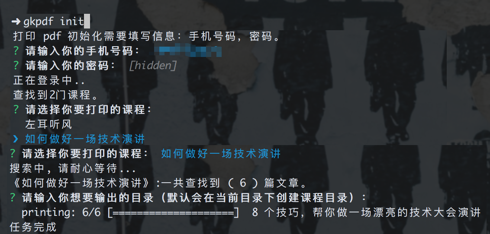

# geek-time-topdf

print your geek time course to pdf. If you have already bought it

need phone, password, course name.

Do not record any information...

```sh
npm install geek-time-topdf -g  # in china use cnpm 推荐使用 cnpm，加快安装速度

gkpdf init # 账号初始化
gkpdf clear # 清除账号信息
```

将你**已经购买**的极客时间的课程，打印为 pdf。

需要手机号码和密码。课程名称

**不记录任何信息**

操作说明：



## Run in docker container via VSCode

Open this folder in container in VSCode.

Or add `--cap-add=SYS_ADMIN` when run and build the docker image alone.

changeLogs:
- 4.0.5: feat: 添加 clear 命令。用于切换账号
- 4.0.4: fix: 修复 windows 下文件名存在非法字符导致的下载出错
- 4.0.3: fix: 修复课程打印不出来的问题
- 4.0.2: fix: 课程名称处理正则未全局匹配
- 4.0.1: fix: 课程展示不全
- 4.0.0: 调整为接口获取课程方式。（**必须更新，旧的包已不可使用**）
- 3.2.0: 调整了课程搜索的滚动方式，增加成功率
- 3.0.0: 处理极客时间登陆改版，导致登陆不了的问题，并且加了一个重复打印的选项
- 2.0.2: 修改页面滚动的等待时间，提高成功率
- 2.0.1: 修复 windows 系统下 特殊中文字符 pdf 生成报错的问题
- 2.0.0: 更新代码来支持极客时间的最新版页面（**必须更新，旧的包已不可使用**）
- 1.1.4: 修复自定义目录时，未正确创建目录的 bug
- 1.1.2: 版本添加 png 输出选项

TODO:

- [ ] 一键下载所有课程
- [ ] 出错自动重试
- [ ] puppeteer page 并行
